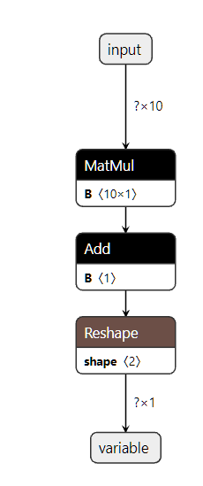
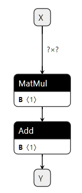

ONNX Concepts
=============

ONNX can be compared to a programming language specified
in mathematical functions. It defines all the necessary operations
a machine learning model needs to implement its inference function
with this langage. A linear regression could be represented
the following way:

::

    def onnx_linear_regressor(X):
        "ONNX code for a linear regression"
        return onnx.Add(onnx.MatMul(X, coefficients), bias)

.. index:: ONNX graph

This example is very similar to an expression a developper could
write in Python. It can be also represented as a graph which shows
step by step how to transform the features to get a prediction.
That's why a machine learning model implemented with ONNX is often
referenced as an **ONNX graph**.

ONNX aims at providing a common language any machine learning framework
can use to describe its models. The first scenario is to make it easier
to deploy a machine learning model in production. An ONNX interpretor
(or **runtime**) can be specifically implemented and optimized for this task
in the environment where it is deployed. With ONNX, it is possible
to build a unique process to deploy a model in production and independant
from the learning framework used to build the model.

.. contents::
    :local:

Input, Output, Node, Initializer
++++++++++++++++++++++++++++++++

Building an ONNX graph means implementing a function
with the ONNX language or more precisely the :ref:`l-onnx-operators`.
It is easier to read when there is one operator per line.
A linear regression would be written this way.

::

    x = onnx.input(0)
    a = onnx.input(1)
    c = onnx.input(2)

    ax = onnx.MatMul(a, x)
    axc = onnx.Add(ax, c)

    onnx.output(0) = axc

This code implements a function with the signature `f(x, a, c) -> axc`.
*a*, *a*, *c* are the **inputs**, *axc* is the **output**.
*ax* is an intermediate result.
Inputs and outputs are changing at each inference.
*MatMul* and *Add* are the **nodes**. They also have inputs and outputs.
A node has also a type, one of the operators in
:ref:`l-onnx-operators`. This graph was built with the example
in Section :ref:`l-onnx-linear-regression-onnx-api`.

The graph could also have an **initializer**. When an input
never changes such as the coefficients of the linear regression,
it be turned into a constant and stored into the graph.

::

    x = onnx.input(0)
    a = initializer
    c = initializer

    ax = onnx.MatMul(a, x)
    axc = onnx.Add(ax, c)

    onnx.output(0) = axc

Visually, this graph would look like this
(initializers are hidden). This graph was obtained with this
code :ref:`l-onnx-linear-regression-onnx-api-init`.

Serialization with protobuf
+++++++++++++++++++++++++++

The deployment of a machine learned model into production
usually requires to replicate the entire ecosystem used to
train the model, most of the time with a :epkg:`docker`.
Once a model is converted into ONNX, the production environment
only needs a runtime to execute the graph defined with ONNX
operators. This runtime can be developped in any language
suitable for the production application, C, java, python, javascript,
C#, Webassembly, arm...

But to make that happen, the ONNX graph needs to be saved and it should
take as less space as possible. That's why ONNX uses :epkg:`protobuf` to
serizalize the graph into one single block
(see `Parsing and Serialization
<https://developers.google.com/protocol-buffers/docs/pythontutorial#
parsing-and-serialization>`_).

Metadata
++++++++

Machine learned models are continuously refreshed. It is important
to keep track of the model version, the author of the model,
how it was train. ONNX offers the possibility to store additional data
into the model itself.

* **doc_string**: Human-readable documentation for this model.
    Markdown is allowed.
* **domain**: A reverse-DNS name to indicate the model namespace or domain,
    for example, 'org.onnx'
* **metadata_props**: Named metadata as dictionary `map<string,string>`,
    `(values, keys)` should be distinct.
* **model_author**: A comma-separated list of names,
    The personal name of the author(s) of the model, and/or their organizations.
* **model_license**: The well-known name or URL of the license
    under which the model is made available.
* **model_version**: The version of the model itself, encoded in an integer.
* **producer_name**: The name of the tool used to generate the model.
* **producer_version**: The version of the generating tool.
* **training_info**: An optional extension that contains
    information for training (see :ref:`l-traininginfoproto`)

List of available operators and domains
+++++++++++++++++++++++++++++++++++++++

The main list is described here: :ref:`l-onnx-operators`.
It merges standard matrix operators (Add, Sub, MatMul, Transpose,
Greater, IsNaN, Shape, Reshape...),
reductions (ReduceSum, ReduceMin, ...)
image transformations (Conv, MaxPool, ...),
deep neural networks layer (RNN, DropOut, ...),
activations functions (Relu, Softmax, ...).
It covers most of the operations needed to implement
inference functions from standard and deep machine learning.
A few operators are dedicated to text but they hardly cover
the needs. The main list also missing tree based models very
popular in standard machine learning.

The main list is identified with a domain **ai.onnx**.
A **domain** can be defined a set of operators.
Additional operators such
are part of another domain **ai.onnx.ml** :ref:`l-onnx-operators-ml`,
it includes tree bases models (TreeEnsmble Regressor, ...),
preprocessing (OneHotEncoder, LabelEncoder, ...), SVM models
(SVMRegressor, ...), imputer (Imputer).

ONNX only defines these two domains. But the library :epkg:`onnx`
supports any custom domains and operators
(see :ref:`l-onnx-extensibility`).

Supported Types
+++++++++++++++

ONNX specifications is optimized for numerical competition with
tensors. A :epkg:`tensor` is a multidimensional array. It is defined
by:

* a type: the element type, the same for all elements in the tensor
* a shape: an array with all dimensions, this array can be empty,
  a dimension can be null
* a contiguous array: it represents all the values

This definition do not includes *strides* or the possibility to define
a part of a tensor based on an existing tensor. An ONNX tensor is a dense
full array.

Element Type
~~~~~~~~~~~~

ONNX was initially developped to help deploying deep learning model.
That's why the specifications was initially designed for floats (32 bits).
The current version supports all common types. Dictionary
:ref:`l-onnx-types-mapping` gives the correspondance between :epkg:`ONNX`
and :epkg:`numpy`.

.. runpython::
    :showcode:

    import re
    from onnx import TensorProto

    reg = re.compile('^[0-9A-Z_]+$')

    values = {}
    for att in sorted(dir(TensorProto)):
        if att in {'DESCRIPTOR'}:
            continue
        if reg.match(att):
            values[getattr(TensorProto, att)] = att
    for i, att in sorted(values.items()):
        si = str(i)
        if len(si) == 1:
            si = " " + si
        print("%s: onnx.TensorProto.%s" % (si, att))

ONNX is strongly typed and its definition does not support
implicit cast. It is impossible to add two tensors or matrices
with different types even if other languages do. That's why explicit
cast must be inserted in a graph.

Sparse Tensor
~~~~~~~~~~~~~

Sparse tensors are useful to represent arrays having many null coefficients.
ONNX supports 2D sparse tensor.

Other types
~~~~~~~~~~~

In addition to tensors and sparse tensors, ONNX supports sequences of tensors,
map of tensors, sequences of map of tensors.

What is an opset version?
+++++++++++++++++++++++++

.. runpython::
    :showcode:

    import onnx
    print(onnx.__version__, onnx.defs.onnx_opset_version())

Subgraphs
+++++++++

.. _l-onnx-extensibility:

Extensibility
+++++++++++++

Shape Inference
+++++++++++++++

Tools
+++++

netron
