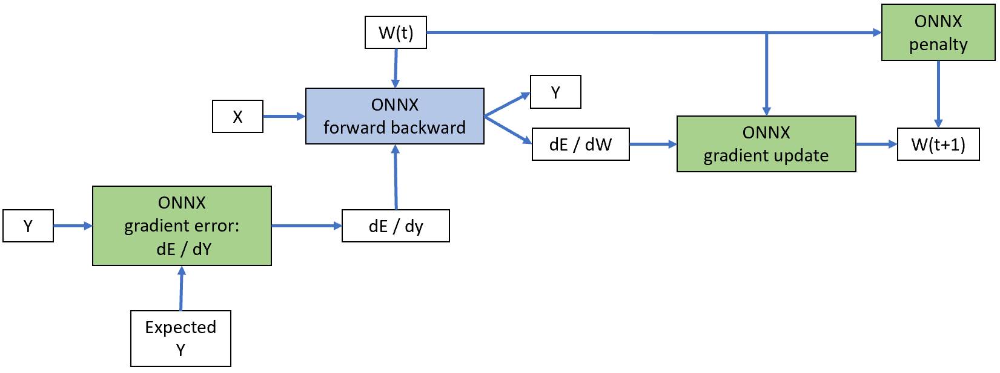

Partial Training with OrtGradientForwardBackwardOptimizer
=========================================================

.. contents::
    :local:

Design
++++++

Section :ref:`l-full-training` introduces a class able to train an
ONNX graph. :epkg:`onnxruntime-training` handles the computation
of the loss, the gradient. It updates the weights as well.
This design does not work when ONNX graph only plays a part
in the model and is not the whole model. A deep neural network could
be composed with a first layer from :epkg:`torch`, a second layer from
ONNX, and be trained by a gradient descent implemented in python.

Partial training is another way to train an ONNX model. It can be trained
as a standalone ONNX graph or be integrated in a :epkg:`torch` model or any
framework implementing *forward* and *backward* mechanism.
It leverages class :epkg:`TrainingAgent` from :epkg:`onnxruntime-training`.
However a couple of lines of code are not enough to use this class.
This package defines a class implementing the missing pieces:
:class:`OrtGradientForwardBackwardOptimizer
<onnxcustom.training.optimizers_partial.OrtGradientForwardBackwardOptimizer>`.
It is initialized with an ONNX graph defining a prediction function.

::

    train_session = OrtGradientForwardBackwardOptimizer(
        onx, ['coef', 'intercept'],
        learning_rate=LearningRateSGDNesterov()
        learning_loss=ElasticLearningLoss(l1_weight=0.1, l2_weight=0.9),
        learning_penalty=ElasticLearningPenalty(l1=0.1, l2=0.9))

The class uses :epkg:`onnxruntime-training` to build two others,
one to predict with custom weights (and not initializers),
another to compute the gradient. It implements *forward* and *backward*
as explained in section :ref:`l-orttraining-second-api`.

In addition the class holds three attributes defining the loss, its gradient,
the regularization, its gradient, a learning rate possibly with momentum.
They are not implemented in :epkg:`onnxruntime-training`.
That's why they are part of this package.

* ``train_session.learning_loss``: an object inheriting from
  :class:`BaseLearningLoss
  <onnxcustom.training.sgd_learning_loss.BaseLearningLoss>`
  to compute the loss and its gradient,
  for example :class:`SquareLearningLoss
  <onnxcustom.training.sgd_learning_loss.SquareLearningLoss>`
  but it could be :class:`ElasticLearningPenalty
  <onnxcustom.training.sgd_learning_penalty.ElasticLearningPenalty>`).
* ``train_session.learning_rate``: an object inheriting from
  :class:`BaseLearningRate
  <onnxcustom.training.sgd_learning_rate.BaseLearningRate>`
  to update the weights. That's where the learning rate takes place.
  It can be a simple learning rate for a stockastic
  gradient descent :class:`LearningRateSGD
  <onnxcustom.training.sgd_learning_rate.LearningRateSGD>` or
  something more complex such as :class:`LearningRateSGDNesterov
  <onnxcustom.training.sgd_learning_rate.LearningRateSGDNesterov>`.
* ``train_session.learning_penalty``: an object inheriting from
  :class:`BaseLearningPenalty
  <onnxcustom.training.sgd_learning_penalty.BaseLearningPenalty>`
  to penalize the weights, it could be seen as an extension
  of the loss but this design seemed more simple as it does not mix
  the gradient applied to the output and the gradient due to the
  regularization, the most simple regularization is no regularization with
  :class:`NoLearningPenalty
  <onnxcustom.training.sgd_learning_penalty.NoLearningPenalty>`,
  but it could be L1 or L2 penalty as well with :class:`ElasticLearningPenalty
  <onnxcustom.training.sgd_learning_penalty.ElasticLearningPenalty>`.

Following graph summarizes how these pieces are gathered altogether.
Blue piece is implemented by :epkg:`onnxruntime-training`. Green pieces
represents the three ONNX graphs needed to compute the loss and its gradient,
the regularization, the weight update.

The design seems over complicated
compare to what :epkg:`pytorch` does. The main reason is :class:`torch.Tensor`
supports matrix operations and class :epkg:`OrtValue` does not.
They can only be manipulated through ONNX graph and :epkg:`InferenceSession`.
These three attributes hide ONNX graph and :epkg:`InferenceSession` to compute
loss, regularization and their gradient, and to update the weights accordingly.
These three classes all implement method `build_onnx_function` which
creates the ONNX graph based on the argument the classes were
initialized with.
Training can then happen this way:

::

    train_session.fit(X_train, y_train, w_train)

Coefficients can be retrieved like the following:

::

    state_tensors = train_session.get_state()

And train losses:

::

    losses = train_session.train_losses_

Method :meth:`save_onnx_graph
<onnxcustom.training._base.BaseOnnxClass.save_onnx_graph>`
exports all graphs used by a model. It can be saved on disk
or just serialized in memory.
Next examples show that in practice.

Cache
+++++

Base class :class:`BaseLearningOnnx
<onnxcustom.training._base_onnx_function.BaseLearningOnnx>` implements
methods :meth:`_bind_input_ortvalue
<onnxcustom.training._base_onnx_function.BaseLearningOnnx._bind_input_ortvalue>`
and :meth:`_bind_output_ortvalue
<onnxcustom.training._base_onnx_function.BaseLearningOnnx._bind_output_ortvalue>`
used by the three components mentioned above. They cache the binded pointers
(the value returns by `c_ortvalue.data_ptr()` and do not bind again
if the method is called again with a different `OrtValue` but a same pointer
returned by `data_ptr()`.

Binary classification
+++++++++++++++++++++

Probabilities are computed from raw scores with a function such as the
`sigmoid function <https://en.wikipedia.org/wiki/Sigmoid_function>`_.
A binary function produces two probilities: :math:`sigmoid(s)`
:math:`(1 - sigmoid(s))` where *s* is the raw score. The associated loss
function is usually the log loss: :math:`loss(y, X) =
(1-y) \log(1-p(s)) + y \log p(s)` where *y* is the expected class (0 or 1),
*s=s(X)* is the raw score, *p(s)* is the probability.
We could compute the gradient of the loss
against the probability and let :epkg:`onnxruntime-training` handle the
computation of the gradient from the probability to the input.
However, the gradient of the loss against the raw score can easily be
expressed as :math:`grad(loss(y, s)) = p(s) - y`. The second
option is implemented in example :ref:`l-orttraining-benchmark-fwbw-cls`.

Examples
++++++++

This example assumes the loss function is not part of the graph to train
but the gradient of the loss against the graph output is provided.
It does not take care to the weight. This part must be separatly
implemented as well. Next examples introduce how this is done
with ONNX and :epkg:`onnxruntime-training`.

.. toctree::
    :maxdepth: 1

    ../../gyexamples/plot_orttraining_linear_regression_fwbw
    ../../gyexamples/plot_orttraining_nn_gpu_fwbw
    ../../gyexamples/plot_orttraining_nn_gpu_fwbw_nesterov
    ../../gyexamples/plot_orttraining_benchmark_fwbw
    ../../gyexamples/plot_orttraining_benchmark_fwbw_cls
    ../../gyexamples/plot_benchmark_onnx_function
